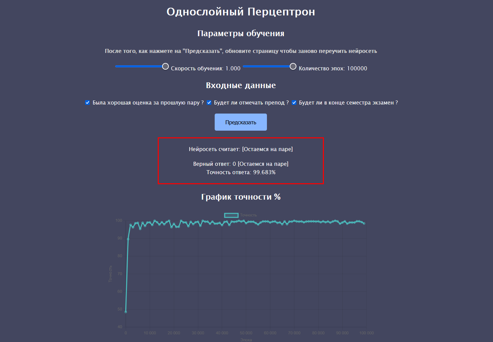

# Однослойный Перцептрон

Этот проект демонстрирует работу **однослойного перцептрона** с **3 входами, 2 скрытыми нейронами и 1 выходным нейроном**. Он отвечает на вопрос: **идти ли на следующую пару**, анализируя три фактора:

1. **Была оценка за прошлую пару?**
2. **Будет ли отмечать преподаватель?**
3. **Будет ли экзамен по этому предмету в конце сессии?**

Пользователь может **отмечать входные данные с помощью чекбоксов**. Также можно настроить **число эпох** и **скорость обучения**, после чего запускать процесс тренировки нейросети.

Визуализация результатов представлена в виде:
- **Графика точности** ответа перцептрона по эпохам (истории тренировки)
- **Схемы перцептрона** (отрисованного в p5.js)



---

## 🚀 Запуск проекта

1. Установите зависимости:
   ```bash
   npm install
   ```
2. Запустите локальный сервер:
   ```bash
   npx vite
   ```
3. Откройте проект по проделоженной ссылке в браузере.

---

## 📁 Структура проекта

```
│   .gitignore
│   DEVELOPMENT.md
│   eslint.config.mjs
│   favicon.ico
│   index.html
│   LICENSE
│   package-lock.json
│   package.json
│   README.md
│
├───modules docs       # Документация по библиотекам
│       charts.md      # Описание работы с графиками
│       math.md        # Описание математических функций
│       p5.md          # Описание работы с p5.js
│
└───src
    │   index.js       # Основной JS-файл
    │
    ├───constants
    │       selectors.js   # Константы для селекторов элементов
    │
    ├───data
    │       trainingData.json  # Датасет для тренировки
    │
    ├───helpers
    │       chart.js      # Визуализация графиков
    │       math.js       # Математические операции
    │
    ├───modules
    │       createNeuronNetwork.js    # Создание нейросети
    │       reverseDistribution.js    # Алгоритм обратного распространения ошибки
    │
    ├───p5
    │       perceptronSketch.js  # Визуализация схемы перцептрона
    │
    ├───preload
    │       inputRangeListeners.js  # Обработчики событий для range-инпутов
    │
    ├───styles
    │       index.css    # Основные стили проекта
    │
    └───utils
            certaintyChart.js  # Создание и обновление графика точности
```

---

## 📊 Функционал

- **Выбор входных данных через чекбоксы**
- **Настройка параметров обучения** (скорость и число эпох)
- **Запуск обратного распространения ошибки** для тренировки модели
- **Отображение точности модели** в зависимости от числа эпох
- **Графическая схема перцептрона** (отрисовка нейронов и связей в p5.js)

---

## 🛠 Используемые технологии

- **JavaScript** – основной язык разработки
- **p5.js** – визуализация структуры перцептрона
- **Chart.js** – построение графиков точности
- **Math.js** – математические операции для обучения

---

## 🎯 Как работает нейросеть

Перцептрон обучается на основе датасета `trainingData.json`. Во время обучения используется **обратное распространение ошибки**, корректируя веса связей нейронов. После обучения модель делает предсказание, насколько вероятно, что стоит **идти на пару**.

**Формат данных для тренировки:**
```json
[
  { "inputs": [1, 0, 1], "target": 0 },
  { "inputs": [0, 1, 1], "target": 1 }
]
```

- **`inputs`** – входные значения (0 или 1)
- **`target`** – ожидаемый результат (0 – остаемся, 1 – уходим)

---

## 🖥 Разработчики

- **Автор:** Wildcat2k21

---

## 📜 Лицензия

Этот проект распространяется под лицензией **MIT**.

